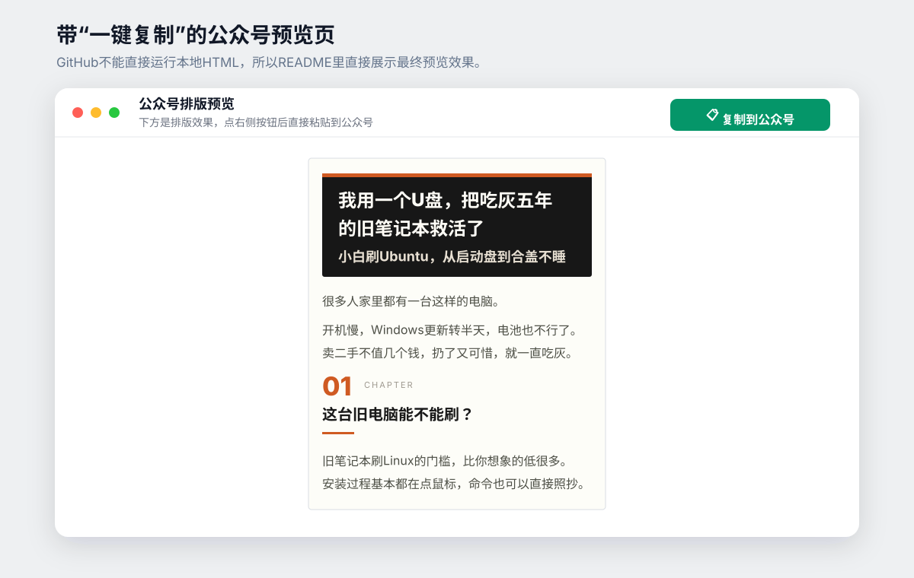
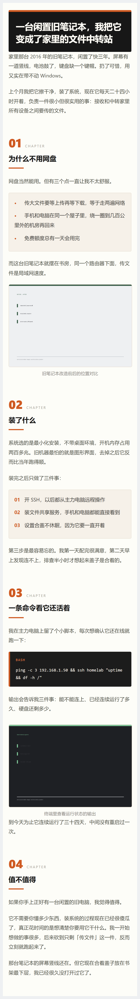
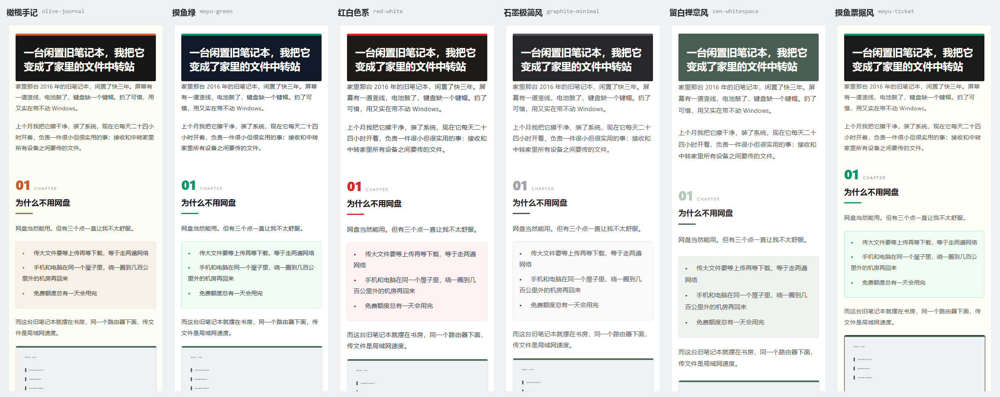

# wechat-article-pipeline

**Markdown+本地配图，一键生成公众号兼容HTML、复制预览、390px手机长截图和完整性报告。**

面向Windows，也适合直接交给ChatGPT、Claude或Codex执行。

- 不改原稿
- 不自动发布
- 不把本机绝对路径写进公开报告
- 图片缺失或HTML校验失败时直接停止

| 我现在要做什么 | 直接看这里 |
| --- | --- |
| 在Windows电脑上一键排版 | [快速开始](#最快开始) |
| 安装成Skill交给Codex执行 | [安装成Skill](docs/skill-install.md) |
| 把文章直接丢给ChatGPT处理 | [AI执行提示词](docs/agent-prompt.md) |
| 安装运行环境 | [Windows安装](docs/windows-install.md) |
| 查看项目来源和分工 | [致谢与项目边界](docs/credits.md) |
| 发布前检查隐私 | [公开前脱敏检查](docs/privacy-check.md) |

## 安装成Skill

想让Codex按固定规则接手定稿后的排版，直接看[安装成Skill](docs/skill-install.md)。仓库根目录的`SKILL.md`已经写好Windows和非Windows两套执行路径，也写死了不改正文、不动图片顺序、缺图停止和未经确认不创建公众号草稿这些边界。

## 最终效果

GitHub不能直接运行仓库里的本地HTML，所以这里放一张带复制按钮的预览页截图。实际生成后，点右上角按钮，再到公众号编辑器里`Ctrl+V`即可。



仓库里也保留了一张390px手机端完整长截图：



示例的[Markdown原稿](examples/demo-article/终稿.md)和[完整输出目录](examples/demo-article/sample-output/)都在仓库里，可以直接对照输入和输出。

## 最快开始

准备好Windows、Python和gzh-design后，在仓库目录运行：

```powershell
.\tools\公众号排版.ps1 -ArticleDir .\examples\demo-article -OpenPreview
```

脚本会依次完成：

1. 检查Markdown里的本地图片
2. 生成公众号兼容的内联HTML
3. 生成图片内嵌的发布稳定版
4. 校验主题组件和最终HTML
5. 生成带复制按钮的浏览器预览
6. 确认原始Markdown没有被修改
7. 清理报告中的本机路径并检查常见敏感信息

也可以把文章目录直接拖到`tools\公众号排版.bat`上。

## 直接交给ChatGPT

不在自己的电脑前，也不需要远程回去开Codex。

把下面这些文件上传给支持代码执行的ChatGPT、Claude或Codex：

- 定稿Markdown
- Markdown引用的全部图片
- `tools/render_wechat.py`
- `tools/stitch_screenshot.py`

然后复制这里的现成提示词：

**[docs/agent-prompt.md](docs/agent-prompt.md)**

AI执行完成后，应返回一套zip，其中至少包含：

- 干净正文HTML
- 图片内嵌的发布稳定版
- 带一键复制按钮的预览页
- 390px手机端长截图
- 图片证据表
- 原稿哈希与HTML校验报告

## 新文章怎么用

新建一个文章目录，把Markdown和配图放进去：

```text
我的文章/
├─ 终稿.md
└─ assets/
   ├─ 配图1.png
   └─ 配图2.jpg
```

运行：

```powershell
.\tools\公众号排版.ps1 -ArticleDir .\我的文章 -OpenPreview
```

目录里有多个Markdown时，通过`-Markdown`指定：

```powershell
.\tools\公众号排版.ps1 `
  -ArticleDir .\我的文章 `
  -Markdown 文章终稿.md `
  -OpenPreview
```

脚本不会覆盖原始Markdown，只会在文章目录下新增`公众号排版`文件夹。

## 输出文件

| 文件 | 用途 |
| --- | --- |
| `output\*_排版_*.html` | 干净正文HTML，全部使用内联样式 |
| `output\*_发布稳定版.html` | 图片转成data URI，不依赖本地路径 |
| `output\*_预览.html` | 带“复制到公众号”按钮的浏览器预览 |
| `output\*_手机截图页.html` | 无悬浮工具栏的390px视觉检查页 |
| `图片证据表.md` | 图片顺序、路径、所属章节和用途 |
| `手机端结构脚本.md` | 手机端结构和排版检查基线 |
| `source-integrity.json` | 原稿哈希、正文顺序和图片完整性信息 |
| `image-map.json` | 后续上传公众号素材时使用的图片映射 |
| `validation\` | 主题组件与HTML校验日志 |
| `workflow-result.json` | 本次运行结果摘要 |
| `privacy-audit.json` | 路径清理和敏感信息检查结果 |

`tools/stitch_screenshot.py`可以把浏览器分段截图拼成一张390px手机端完整长图。

## 六套主题

```powershell
.\tools\公众号排版.ps1 -ArticleDir .\我的文章 -Theme red-white
.\tools\公众号排版.ps1 -ListThemes
```



| 主题 | 标识 | 适合内容 |
| --- | --- | --- |
| 橄榄手记 | `olive-journal` | 内刊手记、深度评测、案例复盘，默认主题 |
| 摸鱼绿 | `moyu-green` | 教程、测评、清单、工具盘点 |
| 红白色系 | `red-white` | 深度分析、观点和强调型内容 |
| 石墨极简风 | `graphite-minimal` | 设计、科技评论和专业内容 |
| 留白禅意风 | `zen-whitespace` | 随笔、生活方式和低密度内容 |
| 摸鱼票据风 | `moyu-ticket` | 测评、工具对比和清单类内容 |

主题切换主要调整颜色、字体、间距和排印参数，六套主题共用同一套文章结构。

需要gzh-design原生的完整主题组件体系，可以直接查看[gzh-design](https://github.com/isjiamu/gzh-design-skill)。

## 安全边界

这套工作流默认遵守4条规则：

1. **不覆盖原始Markdown。** 运行前后分别计算SHA256，不一致就停止。
2. **不自动发布。** 创建公众号草稿必须由用户明确确认。
3. **不二次渲染。** 不调用`md2wechat convert`重新排版，避免破坏已经生成的内联样式。
4. **不公开本机路径。** 输出报告会把文章目录、用户目录等绝对路径替换成占位符，并检查常见Token、私钥、邮箱、UUID和IP残留。

公众号AppID和AppSecret只应保存在本地环境变量或安全配置中，不应写进Markdown、HTML、日志或Git仓库。

## 安装

完整步骤见[Windows安装](docs/windows-install.md)。

基础环境：

- Windows 10或Windows 11
- Python 3.10+
- PowerShell 5.1或PowerShell 7
- Pillow
- [gzh-design](https://github.com/isjiamu/gzh-design-skill)

## 这个仓库负责什么

这个仓库没有把所有能力重新实现一遍，而是把公众号HTML生成、手机端检查和发布能力整理成一条适合Windows日常使用的流程。

它补充了：

- PowerShell一键脚本和BAT拖拽入口
- 原稿SHA256和正文顺序完整性校验
- 图片存在性检查、图片证据表和图片映射表
- 图片内嵌的发布稳定版HTML
- 六套主题的参数化切换
- 390px手机端QA和长截图拼接
- 公开前路径清理与敏感信息检查
- “不发布、不覆盖、不二次渲染”的安全边界

依赖项目、作者和具体分工见[致谢与项目边界](docs/credits.md)。

## License

本仓库自有代码采用MIT License，见[LICENSE](LICENSE)。

依赖项目各自的许可证和使用范围，以它们各自仓库中的说明为准。
